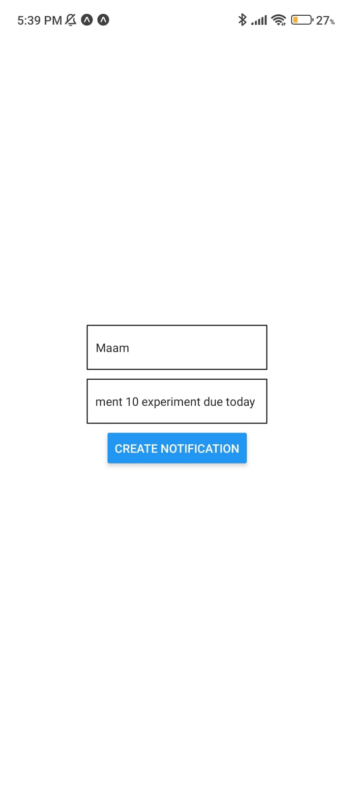
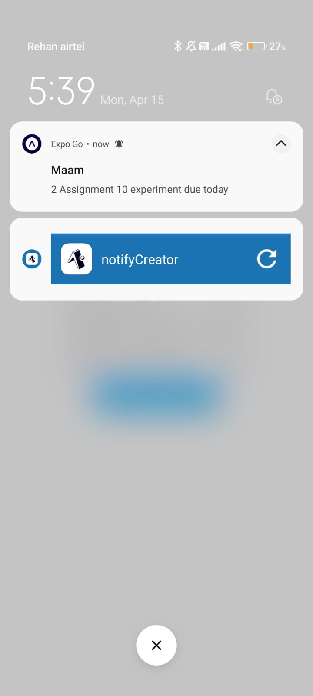

# Notification Creator App

This React Native component allows users to create and schedule notifications using the `expo-notifications` package. Users can input the title and message for the notification, and upon pressing the "Create Notification" button, the notification will be scheduled.

## Features

- **Notification Creation**: Users can input the title and message for the notification.
- **Scheduled Notifications**: Upon pressing the "Create Notification" button, the notification is scheduled to appear.
- **Permission Handling**: The app requests permission from the user to receive notifications.

## Screenshots
<div style={display:'flex', width:'300'}>


</div>
## Usage

1. Install dependencies: `npm install`
2. Run the application: `npm start`

## Dependencies

- React Native
- expo-notifications

## Installation

To run the application on your local machine, follow these steps:

1. Clone the repository:
   ```
   git clone https://github.com/rsayyed591/notifyCreator.git
   ```
2. Navigate to the project directory:
   ```
   cd notification-creator
   ```
3. Install dependencies:
   ```
   npm install
   ```
4. Run the project:
   ```
   npm start
   ```
5. Open the project in your preferred development environment (Expo Go app or simulator) to view and test the Notification Creator app.

## Credits

This project was created by [Rehan Sayyed]. Feel free to contribute or report issues on the [GitHub repository](https://github.com/rsayyed591/notifyCreator.git).
